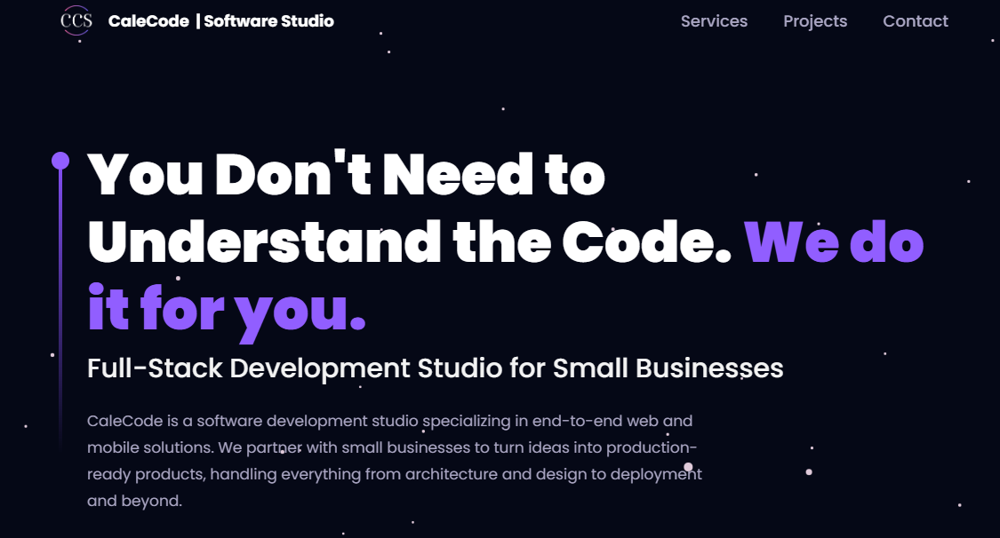

# 🚀 CaleCode — Software Studio

> **You Don't Need to Understand the Code. We do it for you.**

[](https://calecode.dev)



---

## 🏢 What is CaleCode?

CaleCode is a full-stack software development studio building web and mobile products for small businesses. From idea to deployment, we handle it all — so you can focus on running your business.

---

## 🛠️ Services

| Service | Description |
|---|---|
| 🌐 Web Development | Custom websites and web applications |
| 📱 Mobile Development | Cross-platform mobile apps |
| ⚙️ SaaS & Product Building | End-to-end product design and development |
| 💡 Tech Consulting | Strategy, architecture, and technical guidance |

---

## 🎯 Featured Projects

- **[Lanwi](https://lanwi.app)** — All-in-one language learning platform
- **[The Soccer Lab](https://thesoccerlab.pro)** — Soccer academy management platform
- **[StoreIt](https://cc-storeit.vercel.app)** — Secure cloud storage solution

---

## ⚡ Tech Stack


---

## 🧑‍💻 Local Development

```bash
# Install dependencies
pnpm install

# Start dev server
pnpm run dev

# Build for production
pnpm run build
```

---

## 📬 Contact

Have a project in mind? Reach out at **[calecode.dev/#contact](https://calecode.dev/#contact)**

---

<p align="center">© 2025 CaleCode Inc. All rights reserved.</p>
